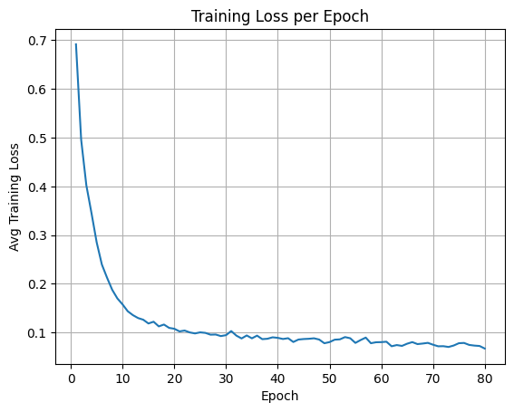
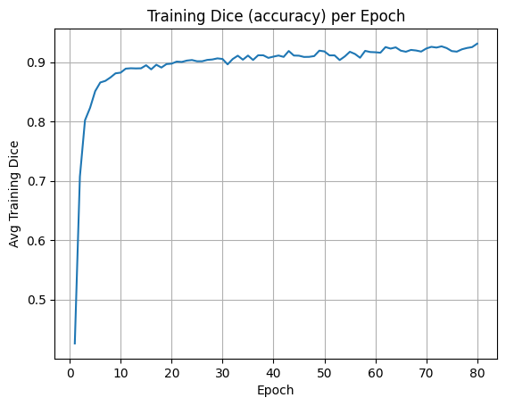
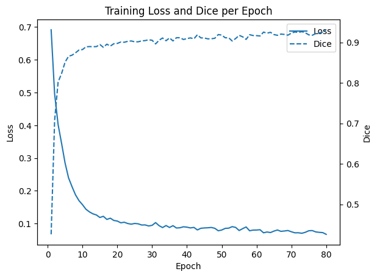
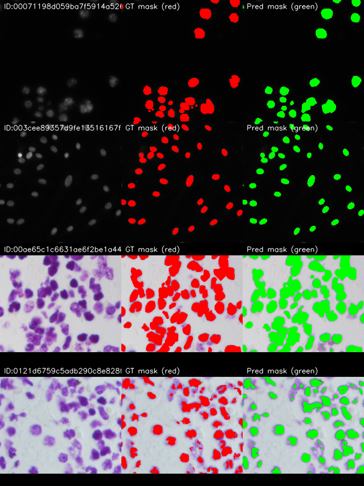

# Identification and Segmentation of Nuclei in Cells
**U-Net (Decoder) with EfficientNet-B3 (Encoder)**


---

> Complete, reproducible pipeline for nuclei segmentation on microscopy images (Data Science Bowl 2018). Implemented in **PyTorch** using **segmentation_models_pytorch (SMP)**, augmentation via **albumentations**, training/inference utilities, visualization and RLE submission helpers.

---

## Table of contents
1. [Project overview](#project-overview)  
2. [Key features](#key-features)  
3. [Results (summary)](#results-summary)  
4. [Repository structure](#repository-structure)  
5. [Quickstart — Installation](#quickstart--installation)  
6. [Dataset preparation](#dataset-preparation)  
7. [Usage](#usage)  
   - [Train](#train)  
   - [Evaluate](#evaluate)  
   - [Inference / Create submission](#inference--create-submission)  
8. [Model & training details](#model--training-details)  
   - [Architecture](#architecture)  
   - [Loss & metrics](#loss--metrics)  
   - [Transforms / augmentation](#transforms--augmentation)  
   - [Hyperparameters](#hyperparameters)  
9. [Code snippets (important helpers)](#code-snippets-important-helpers)  
10. [Visuals & outputs](#visuals--outputs)  
11. [Troubleshooting & tips](#troubleshooting--tips)  
12. [Authors & contributions](#authors--contributions)  
13. [How to contribute](#how-to-contribute)  
14. [Acknowledgements](#acknowledgements)

---

## Project overview
This project implements a semantic segmentation pipeline to identify and segment nuclei inside microscopy images. The model is a U-Net decoder paired with an **EfficientNet-B3** encoder (pretrained on ImageNet). The pipeline covers:

- RLE (Run-Length Encoding) handling for Kaggle-style masks
- Full dataset preprocessing & augmentation
- Training, checkpointing and visualization
- Inference and RLE submission generation
- Evaluation (Dice, IoU) against `test_solution.csv`

The goal: produce accurate pixel-wise binary masks (nucleus vs background) and provide reproducible scripts and notebooks for experimentation.

---

## Key features
- Pretrained EfficientNet-B3 encoder (SMP) + U-Net decoder
- Hybrid loss: `0.5 * BCEWithLogits + 0.5 * DiceLoss`
- Albumentations augmentation pipeline
- RLE encode / decode helpers for CSV submission
- Visual outputs (input / GT / prediction overlays)
- Checkpointing and training plots saved automatically

---

## Results (summary)
> Example final test (Stage 1, 65 images):
- **Average Dice:** `0.825473`  
- **Average IoU (Jaccard):** `0.723451`  
- **Average hybrid loss:** `0.415633`

Baseline (U-Net random init): Dice ≈ `0.6848`, IoU ≈ `0.5923`.


---

## Repository structure
```
project/
├── Train.csv                         # RLE masks (training CSV)
├── test_solution.csv                 # RLE ground truth for Stage1 test (for evaluation)
├── submission.csv                    # generated submission (RLE)
├── submission_test2.csv              # generated submission for Test2 (if any)
├── unet_effnet_nuclei.pth            # example / final model weights
├── main.ipynb                        # notebook for exploration / training
├── src/
│   ├── dataset.py                    # Dataset and RLE helpers
│   ├── model.py                      # model instantiation (SMP Unet)
│   ├── train.py                      # training loop
│   ├── inference.py                  # inference & submission generation
│   ├── utils.py                      # metrics, visualization, plotting
│   └── losses.py                     # hybrid loss (BCE + Dice)
├── training_visuals/                 # overlay visuals saved during training
├── training_plots/                   # loss & Dice plots
├── notebooks/                        # extra notebooks
├── requirements.txt                  # pip dependencies
└── README.md
```

---

## Quickstart — Installation

1. Clone repo:
```bash
git clone https://github.com/chaman-yadav/Identification-and-Segmentation-of-Nuclei-in-Cells.git
cd Identification-and-Segmentation-of-Nuclei-in-Cells
```

2. Create environment (recommended):
```bash
python -m venv venv
source venv/bin/activate         # Linux / macOS
venv\Scripts\activate            # Windows
```

3. Install dependencies:
```bash
pip install -r requirements.txt
```
Example `requirements.txt` contents:
```
torch>=1.10
torchvision
segmentation-models-pytorch
albumentations
opencv-python
numpy
pandas
matplotlib
tqdm
scikit-learn
tensorboard; # optional
```

> GPU recommended for training. Ensure CUDA-compatible PyTorch is installed.

---

## Dataset preparation
1. Download DSB2018 dataset from Kaggle (Data Science Bowl 2018). Place images and `Train.csv` in `data/` consistent with the repo `dataset.py` expectations:
```
data/
 ├── Train/<ImageId>/images/*.png
 ├── Test/<ImageId>/images/*.png
```

2. Ensure `Train.csv` contains columns: `ImageId`, `EncodedPixels` (RLE). For test evaluation, `test_solution.csv` (if available) is used to compute evaluation metrics.

---

## Usage

### Train
A minimal example to train:
```bash
python src/train.py \
  --data_dir ./data \
  --train_csv ./Train.csv \
  --epochs 80 \
  --batch_size 8 \
  --lr 1e-4 \
  --img_size 256 \
  --encoder efficientnet-b3 \
  --encoder_weights imagenet \
  --checkpoint_dir ./checkpoints
```
`train.py` will:
- instantiate dataset/dataloaders,
- create model (SMP Unet),
- run training loop,
- save checkpoints and plots under `training_plots/` and `training_visuals/`.

### Evaluate
Evaluate a checkpoint on Stage1 test set (requires `test_solution.csv`):
```bash
python src/inference.py \
  --data_dir ./data/Test \
  --weights ./checkpoints/unet_effnet_epoch80.pth \
  --output_csv ./submission.csv \
  --img_size 256 \
  --eval_csv ./test_solution.csv \
  --mode eval
```
This will produce per-image Dice/IoU aggregates and a summary table.

### Inference / Create submission
Run inference to create Kaggle submission CSV:
```bash
python src/inference.py \
  --data_dir ./data/Test \
  --weights ./checkpoints/unet_effnet_epoch80.pth \
  --output_csv ./submission.csv \
  --img_size 256 \
  --mode predict
```

---

## Model & training details

### Architecture
- `smp.Unet(encoder_name='efficientnet-b3', encoder_weights='imagenet', in_channels=3, classes=1)`
- Decoder with skip-connections; final 1×1 conv produces logits (no activation).

### Loss & metrics
- Hybrid loss:
  \[
  \mathcal{L} = 0.5 \cdot \text{BCEWithLogitsLoss} + 0.5 \cdot \text{DiceLoss}
  \]
- Metrics:
  - Dice coefficient (primary)
  - IoU (Jaccard)
  - Hybrid loss reported on validation/test sets

### Transforms / augmentation
**Training transforms** (Albumentations example)
```py
A.Compose([
    A.HorizontalFlip(p=0.5),
    A.RandomRotate90(p=0.3),
    A.ShiftScaleRotate(shift_limit=0.0625, scale_limit=0.1, rotate_limit=45, p=0.3),
    A.RandomBrightnessContrast(p=0.3),
    A.Resize(256, 256),
    A.Normalize(mean=(0.485,0.456,0.406), std=(0.229,0.224,0.225)),
    ToTensorV2(),
])
```
**Validation / Inference transforms**: Resize + Normalize + ToTensor

### Hyperparameters 
| Param | Value |
|---|---:|
| Image size | 256 × 256 |
| Batch size | 8 |
| Epochs | 80 |
| Optimizer | Adam |
| Initial LR | 1e-4 |
| Loss | 0.5 * BCE + 0.5 * Dice |
| Inference threshold | 0.5 |

---

## Code snippets (important helpers)

### RLE decode
```py
def rle_decode(mask_rle, shape):
    if pd.isna(mask_rle) or mask_rle == '':
        return np.zeros(shape, dtype=np.uint8)
    s = mask_rle.split()
    starts, lengths = [np.asarray(x, dtype=int) for x in (s[0::2], s[1::2])]
    starts -= 1
    ends = starts + lengths
    img = np.zeros(shape[0] * shape[1], dtype=np.uint8)
    for lo, hi in zip(starts, ends):
        img[lo:hi] = 1
    return img.reshape(shape, order='F')
```

### RLE encode
```py
def rle_encode(mask):
    pixels = mask.T.flatten()
    pixels = np.concatenate([[0], pixels, [0]])
    runs = np.where(pixels[1:] != pixels[:-1])[0] + 1
    runs[1::2] = runs[1::2] - runs[::2]
    if runs.size == 0:
        return ''
    return ' '.join(str(x) for x in runs)
```

### Hybrid loss
```py
bce = nn.BCEWithLogitsLoss()

def dice_loss(preds, targets, eps=1e-7):
    preds = torch.sigmoid(preds)
    preds = preds.view(-1)
    targets = targets.view(-1)
    inter = (preds * targets).sum()
    union = preds.sum() + targets.sum()
    dice = (2. * inter + eps) / (union + eps)
    return 1 - dice

def loss_fn(preds, targets):
    return 0.5 * bce(preds, targets) + 0.5 * dice_loss(preds, targets)
```

---

## Visuals & outputs
- `training_visuals/` contains grids of (input / ground-truth overlay / predicted overlay) saved at checkpoints.
- `training_plots/` contains: `loss_vs_epoch.png`, `dice_vs_epoch.png`, `loss_and_dice.png`.

### Training Plots

### Loss vs Epoch


### Dice vs Epoch


### Loss & Dice Combined


---

### Sample Visual Output


---

## Troubleshooting & tips
- **Low GPU memory**: reduce `batch_size` or use gradient accumulation; or use mixed precision (AMP).
- **Poor validation Dice**: check data loading (RLE decoding), normalization, and augmentation mismatch between train/val.
- **Overfitting**: increase augmentation, add dropout, or reduce learning rate / apply weight decay.
- **Touching nuclei merged**: add postprocessing (watershed, distance transform) or move to instance segmentation (Mask R-CNN) or use marker-based separation.

---

## Authors & contributions
- **Chaman Yadav** — model architecture design; training pipeline development & optimization; experiments; loss/metrics & checkpointing; inference demo; primary report writing & final assembly.  
- **Suryansh Humane** — dataset acquisition & preprocessing; RLE mask handling; visualizations; baseline reproduction; presentation & qualitative results.  
- **Yash S. Bhadauria** — literature review; metrics & experimental analysis; reproducibility & code structuring; documentation and manuscript refinement.

---


## How to contribute
1. Fork the repository.  
2. Create a feature branch (`git checkout -b feat/my-feature`).  
3. Add tests / notebook examples if possible.  
4. Open a Pull Request explaining additions & rationale.

---

## Acknowledgements
- Data Science Bowl 2018 community (Kaggle) for dataset.  
- PyTorch, segmentation_models_pytorch, Albumentations for enabling rapid development.

---
